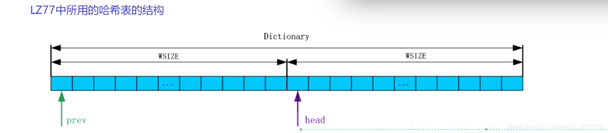
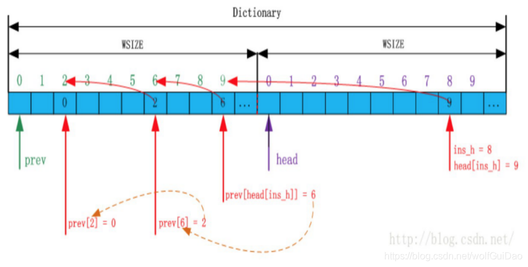
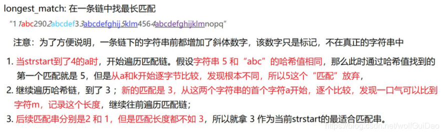
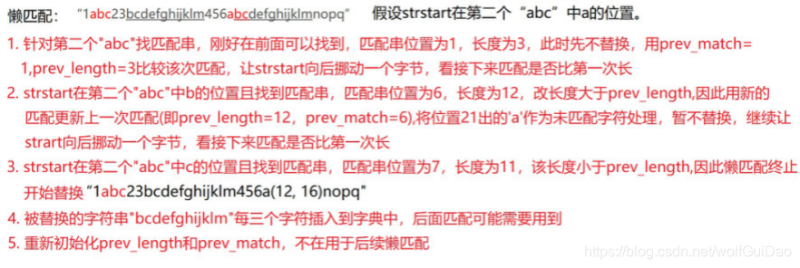

# LZ77
    

1. 从当前压缩位置开始，考察未编码的数据，并试图在滑动窗口中找出最长的匹配字符串，如果找到，则进行步骤 2，否则进行步骤 3。
2. 输出三元符号组 ( off, len, c )。其中 off 为窗口中匹配字符串相对窗口边界的偏移，len 为可匹配的长度，c 为下一个字符。然后将窗口向后滑动 len + 1 个字符，继续步骤 1。
3. 输出三元符号组 ( 0, 0, c )。其中 c 为下一个字符。然后将窗口向后滑动 len + 1 个字符，继续步骤 1。

核心问题, 查找匹配字符串 通过哈希表


1. 确定哈希函数(h = ((p) + ((c) << (WNDBIT - 9)) + WNDSIZ * 2))
    
    p: 当前偏移量字符的ascii值与WNDSIZ的和

    c: 当前偏移量的下一个字符的ascii值
2. 创建哈希表（哈希表存储的是当前字符串首字符的偏移量mPos）- 字典
    - 因为字典由一整块连续内存构成，大小为64KB, 分成head和prev两部分, 因为内存是连续的，所有head，prev可以看作两个数组
    - Hash_value_max = (3 * WNDSIZ + (WNDSIZ / 512 + 1) * UINT8_MAX)
    - prev数组用来解决哈希冲突
        
    - 通过Hash value去head数组中查询，如果head[h]为0，则前面没有出现过当前字符串，为1则出现过

     hash_value = ((p) + ((c) << (WNDBIT - 9)) + WNDSIZ * 2)
    
     head[hash_value] = mPos
    
3. 查找最长匹配（longest_match + 懒匹配）
   - longest_match
      
   - 懒匹配
      
   ```
   
   ```
4. 将源字符和长度距离对的中长度放在一个数组，将距离放在另一个数组，用于后续Huffman进行压缩
   - 因为源字符和长度要放在一个数组，所有要对源字符和长度进行区分，将长度统一向后偏移256位
   - 因为距离用2位字节（0~32768）表示，所有对于距离最多就有三万多个距离节点，导致Huffman树会很长，影响压缩效率，所以需要按照每个距离所占bit位数进行分组
   
      

# Huffman:

- 根据二叉树构建编码压缩结构
- 根据字符出现频率，重新对字符进行编码

Steps:

1. 统计每个字符出现的次数
2. 创建huffman tree
3. 获取字符的编码
4. 用编码改写源文件

Issue: 只能压缩文本文件，不能压缩二进制文件