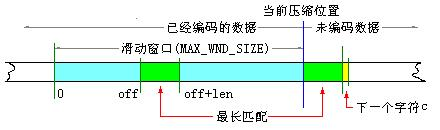
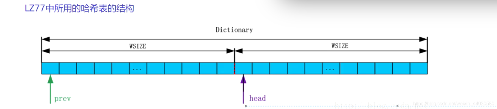

LZ77: 

1. 从当前压缩位置开始，考察未编码的数据，并试图在滑动窗口中找出最长的匹配字符串，如果找到，则进行步骤 2，否则进行步骤 3。
2. 输出三元符号组 ( off, len, c )。其中 off 为窗口中匹配字符串相对窗口边界的偏移，len 为可匹配的长度，c 为下一个字符。然后将窗口向后滑动 len + 1 个字符，继续步骤 1。
3. 输出三元符号组 ( 0, 0, c )。其中 c 为下一个字符。然后将窗口向后滑动 len + 1 个字符，继续步骤 1。

核心问题, 查找匹配字符串 通过哈希表

1. 创建哈希表（哈希表存储的是从查找缓冲区取到的匹配短语首字符的下标）
2. 确定哈希函数

Huffman:

- 根据二叉树构建编码压缩结构
- 根据字符出现频率，重新对字符进行编码

Steps:

1. 统计每个字符出现的次数
2. 创建huffman tree
3. 获取字符的编码
4. 用编码改写源文件

Issue: 只能压缩文本文件，不能压缩二进制文件